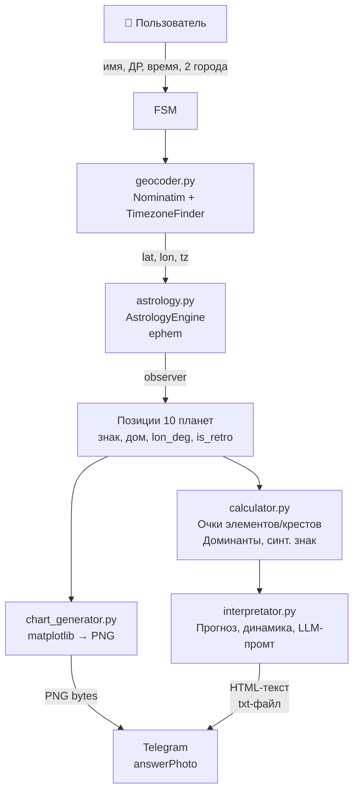

# 🏗 Архитектура проекта MyAstro Bot

## Обзор

**MyAstro Bot** — Telegram-бот на Python, генерирующий персональный астрологический прогноз на месяц на основе метода *Лунарного возврата*. Работает в режиме **long polling**, не требует публичного IP/домена.

---

## Структура файлов

```
my_astro_bot/
├── bot/                        # Telegram-уровень
│   ├── __init__.py
│   ├── main.py                 # Точка входа, dispatcher, роутеры, middleware
│   └── handlers/
│       ├── __init__.py
│       └── registration.py     # FSM-флоу сбора данных и генерации прогноза
│
├── core/                       # Бизнес-логика
│   ├── __init__.py
│   ├── astrology.py            # Расчёт Лунарного возврата, позиции планет, ретроградность
│   ├── calculator.py           # Подсчёт очков элементов/крестов, доминанты
│   ├── chart_generator.py      # Генерация PNG-карты через matplotlib
│   ├── geocoder.py             # Геокодинг города → координаты + часовой пояс
│   └── interpretator.py        # Формирование текстового прогноза и LLM-промта
│
├── data/                       # Статические данные
│   ├── interpretations/        # Тексты интерпретаций (JSON)
│   └── prompts/                # Шаблоны промтов для LLM
│
├── .env                        # Переменные окружения (не коммитить!)
├── .env.example                # Пример переменных
└── requirements.txt            # Python-зависимости
```

---

## Компоненты и их ответственность

### `bot/main.py` — Точка входа
- Инициализирует `Bot` и `Dispatcher` (aiogram 3.x)
- Подключает `MemoryStorage` для FSM-состояний
- Регистрирует `LoggingMiddleware` (логирует все Update)
- Обрабатывает `/start` → показывает кнопку «Начинаем! 🚀»
- Обрабатывает callback `start_forecast` → запускает FSM

### `bot/handlers/registration.py` — FSM-обработчик
Конечный автомат (FSM) с состояниями:

```
waiting_for_name
    ↓
waiting_for_birth_date   (формат: DD.MM.YYYY)
    ↓
waiting_for_birth_time   (формат: HH:MM)
    ↓
waiting_for_birth_city   (геокодинг города рождения)
    ↓
waiting_for_location     (геокодинг текущего города)
    ↓
[process_location]       ← основная логика
```

**`process_location`** выполняет по порядку:
1. Геокодинг текущего города
2. Расчёт Лунарного возврата (`AstrologyEngine`)
3. Расчёт доминант по знакам/домам (`AstroCalculator`)
4. Отправка блока 🔢 данных расчёта
5. Генерация PNG-карты в thread executor → отправка как фото
6. Генерация прогноза (`ReportInterpretator`) → отправка
7. Генерация динамики → отправка
8. Генерация LLM-промта → отправка как `.txt` файл
9. Кнопка «🔄 Начнём заново!»

---

### `core/astrology.py` — AstrologyEngine
**Метод `get_lunar_return(name, year, month, day, hour, minute, lat, lon, utc_offset)`**

Алгоритм:
1. Вычисляет натальное положение Луны (ephem.Moon)
2. Итеративным поиском находит момент, когда Луна возвращается в ту же эклиптическую долготу
3. Формирует `ephem.Observer` для момента Лунарного возврата
4. Вызывает `get_planets_data(observer)` → список планет

**Метод `get_planets_data(observer)`** — для каждой из 10 планет:
- Sun, Moon, Mercury, Venus, Mars, Jupiter, Saturn, Uranus, Neptune, Pluto
- Вычисляет эклиптическую долготу
- Определяет знак зодиака (целое деление на 30°)
- Определяет дом (Whole Sign Houses относительно ASC)
- Определяет **ретроградность**: сравнивает позицию сейчас и через 24 часа

**Вспомогательные методы:**
- `_get_asc_sign(observer)` — ASC через LST
- `_get_mc_sign(observer)` — MC через RAMC
- `get_chart_points(observer)` → `{ascendant, midheaven}`

---

### `core/calculator.py` — AstroCalculator
Считает **очки планет** по элементам (Огонь/Земля/Воздух/Вода) и крестам (Кардинальный/Фиксированный/Мутабельный) — отдельно для знаков и домов. Определяет доминирующий элемент и крест. Вычисляет «синтетический знак» и «синтетический дом».

---

### `core/chart_generator.py` — Генератор карты
Создаёт PNG (~220 КБ) с колесом Лунарного возврата:

| Элемент | Описание |
|---------|---------|
| Зодиакальный круг | 12 секторов по 30°, цвета по стихии (🔴Огонь, 🟢Земля, 🟡Воздух, 🔵Вода) |
| Символы знаков | ♈♉♊♋♌♍♎♏♐♑♒♓ |
| 12 домов | Whole Sign, разделители, номера |
| Оси | ASC / IC / DSC / MC |
| Планеты | Символ ☉☽☿♀♂♃♄♅♆♇ + цветная точка на кольце |
| Ретроградность | Маркер **℞** рядом с планетой |
| Аспекты | Линии внутри колеса по 6 видам: |
| | ☌ Соединение (0°) — жёлтый |
| | ☍ Оппозиция (180°) — красный |
| | △ Трин (120°) — зелёный |
| | □ Квадрат (90°) — красный пунктир |
| | ✶ Секстиль (60°) — синий |
| | ⚻ Квинкункс (150°) — фиолетовый |
| Центр | Имя, дата, время, город |
| Легенда | Планеты + обозначение аспектов |

**Важно:** генерация выполняется в `asyncio.run_in_executor` (отдельный поток), т.к. matplotlib CPU-блокирующий (~2-60 сек при первом рендере).

---

### `core/geocoder.py` — Геокодер
- Использует **Nominatim** (OpenStreetMap, бесплатно, без API-ключа)
- Валидирует что результат — населённый пункт (не река, не гора)
- Определяет timezone через **TimezoneFinder** (offline, локальная БД)
- Возвращает: `{lat, lon, timezone_name, utc_offset_hours, display_name}`

---

### `core/interpretator.py` — ReportInterpretator
- `generate_report(...)` — прогноз на месяц (HTML для Telegram)
- `generate_dynamics_report(...)` — динамика по дням
- `generate_llm_prompt(...)` — структурированный промт для ChatGPT/Claude

---

## Поток данных



---

## FSM-состояния

```python
class RegistrationStates(StatesGroup):
    waiting_for_name        = State()
    waiting_for_birth_date  = State()
    waiting_for_birth_time  = State()
    waiting_for_birth_city  = State()
    waiting_for_location    = State()
```

Хранилище: **MemoryStorage** (в памяти, сбрасывается при перезапуске).
На продакшне рекомендуется заменить на **Redis** (`aiogram.fsm.storage.redis`).

---

## Зависимости

### Python (requirements.txt)
```
aiogram==3.17.0            # Telegram Bot API
ephem==4.1.6               # Астрономические расчёты (ephemeris)
geopy>=2.4.0               # Геокодинг (Nominatim)
timezonefinder>=6.2.0      # Определение часового пояса (offline)
pydantic==2.10.6           # Валидация данных
python-dotenv==1.0.1       # Загрузка .env
pytz==2025.1               # Работа с часовыми поясами
python-dateutil==2.9.0     # Парсинг дат
requests==2.32.3           # HTTP (транзитивно для geopy)
matplotlib>=3.10           # Генерация PNG-карты
numpy                      # Математика (зависимость matplotlib)
```

### Системные (Linux/Docker)
```
# Для matplotlib (отрисовка без дисплея):
libgl1              # OpenGL (иногда нужно)

# Шрифты для корректного рендеринга Unicode-символов ♈♉☉☽:
fonts-dejavu-core   # или эквивалент
```

### Внешние сервисы
| Сервис | Зачем | Ключ |
|--------|-------|------|
| Telegram Bot API | Отправка сообщений | BOT_TOKEN |
| Nominatim (OSM) | Геокодинг городов | Не нужен (rate limit: 1 req/sec) |

> [!NOTE]
> **Ephem**, **TimezoneFinder** и **matplotlib** работают полностью офлайн.
